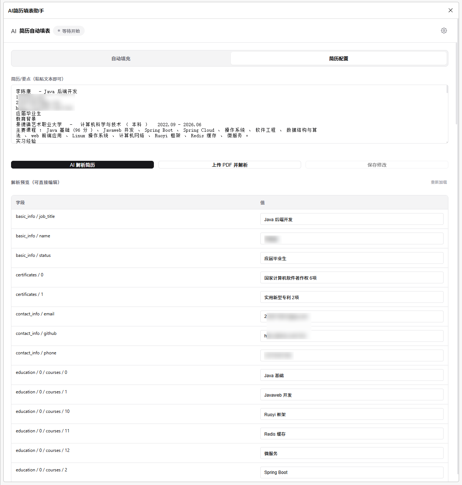
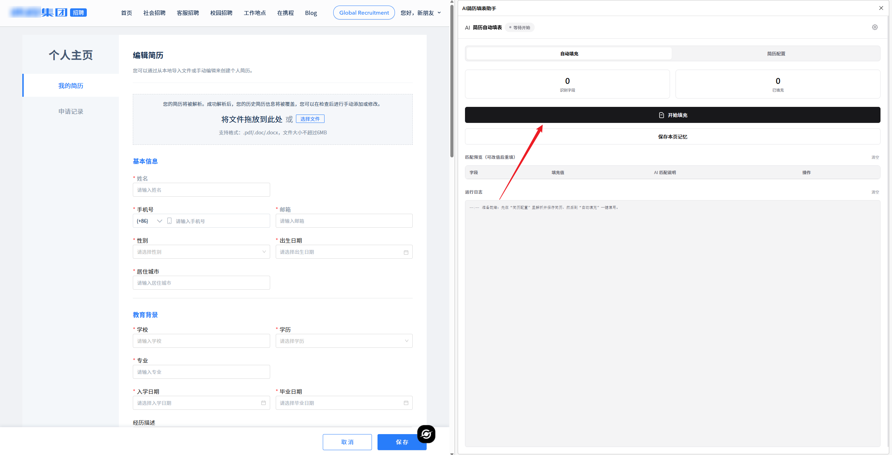

# AI简历填表助手

一个浏览器侧边栏扩展：你只需提供简历文本或上传“有文字层”的 PDF，扩展会用 DeepSeek（或任意 OpenAI 兼容 API）解析简历并在目标网页上自动识别表单字段后“一键填充”（不会自动提交）。

## 界面演示

## 功能
- 简历解析：粘贴简历/要点文本，或上传 PDF 自动提取文字并解析为结构化 JSON
- 解析预览：解析结果以表格展示，支持内联编辑并保存
- 自动填充：识别页面表单字段，AI 生成字段映射并写入输入框/下拉框/单选多选/contenteditable
- 匹配说明：每个字段展示 AI 匹配理由，便于核对
- 单字段重填：可在“匹配预览”里改值后点击“重填本字段”
- 记忆库：对简历未覆盖/AI 不会的特殊字段，填完后可一键“保存本页记忆”，下次遇到相同字段自动补全
- 安全策略：默认不自动提交表单，填充完成后提示“请检查后手动提交”

## 安装（开发者模式）
1. 打开 Chrome：`chrome://extensions/`（Edge：`edge://extensions/`）
2. 开启“开发者模式”
3. 点击“加载已解压的扩展程序”
4. 选择本项目目录（解压后的文件夹）
5. 点击扩展图标打开侧边栏

## 第一次配置（DeepSeek）
1. 侧边栏右上角点击“设置”
2. 选择内置 `DeepSeek`（或添加自定义模型），点击“编辑”
3. 填写并保存：
   - `Base URL`：`https://api.deepseek.com/v1`
   - `API Key`：你的 Key（不要写进代码仓库/不要分享给别人）
   - `模型ID`：例如 `deepseek-chat`

说明：扩展通过 `background.js` 代理调用 OpenAI 兼容接口（`/chat/completions`）。

## 使用方法
### 1）解析并保存简历
进入侧边栏 `简历配置`：
- 方式 A：粘贴文本 → 点击 `AI 解析简历`
- 方式 B：点击 `上传 PDF 并解析`（会本地提取 PDF 文本，再自动调用 AI 解析）

解析完成后：
- 在“解析预览”表格中直接修改字段值
- 点击 `保存修改`

### 2）一键填充网页表单
1. 打开目标网站的表单页面
2. 侧边栏切到 `自动填充`
3. 点击 `开始填充`
4. 填充完成后按提示自行检查并手动提交（扩展不会自动提交）
5. 如有需要：你手动补齐特殊字段后，可点击 `保存本页记忆`，下次自动补全

### 3）单字段重填
在 `自动填充` 的“匹配预览”里：
- 修改某一行“填充值”
- 点击 `重填本字段`

### 4）记忆库（解决“特殊字段”）
当某些字段简历里没有、AI 也无法判断时：
1. 你先在网页上把需要的字段都手动补齐
2. 回到侧边栏 `自动填充`，点击 `保存本页记忆`（会重新解析当前页面并批量保存已填写字段和值）
3. 下次在其它网站遇到相同/相近字段文案时，会在 AI 未能填写的情况下自动用记忆库补全

记忆库管理：在 `简历配置` 底部可查看、删除单条或清空。

## PDF 解析说明
- 仅支持“有文字层”的 PDF（可复制文字的简历 PDF）
- 若是扫描版/图片型 PDF 没有文字层，提取结果会为空，需要先 OCR 或换可复制文字的 PDF

## 隐私与安全提示
- 发送给 AI 的内容可能包含你的简历信息、页面 URL/标题、字段文案与选项等；请自行评估并仅在可信环境使用
- `API Key` 会保存在浏览器的扩展存储中；不要把 Key 写入仓库或截图传播
- 扩展默认不提交表单，仅做填写；你需要自行确认并提交

## 已知限制
- `input[type="file"]`（上传附件/简历文件）受浏览器安全限制，无法自动写入
- 跨域 `iframe` 内的表单可能无法识别/填写（可尝试在 iframe 内部页面打开后再执行）
- 极少数网站会用自定义控件（非原生 input/select），可能需要额外适配

## 常见问题（排查思路）
### 一直显示“填充中”
通常是 API 请求未返回或被阻断：
1. 检查侧边栏底部“运行日志”停在哪一步（常见是“正在调用 AI 生成映射...”）
2. 打开 `chrome://extensions/` → 找到本扩展 → 点击 `Service worker` 的 `Inspect`
3. 在 Console/Network 里查看请求是否报错或一直 pending
4. 确认 Base URL/Key/模型ID 正确、网络可访问 DeepSeek

### 识别不到字段/填不进去
- 表单可能在动态弹窗里：先打开弹窗再点击“开始填充”
- 字段不可见/被禁用：扩展会跳过不可见或 disabled 的控件

## 项目结构（核心文件）
- `manifest.json`：扩展配置（MV3 / side panel）
- `popup.html` / `popup.css` / `popup.js`：侧边栏 UI、简历解析、匹配预览、记忆库
- `background.js`：代理调用 OpenAI 兼容接口（DeepSeek）
- `content.js`：扫描页面字段、调用 AI 映射、自动填充、单字段重填
- `libs/pdfjs/*`：PDF 文本提取（pdf.js）

## License
[GPL-3.0 License](./LICENSE)

## 联系方式

